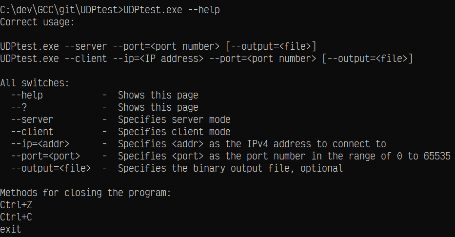

# UDPterminal

> A simple UDP client/server test application

Like the name implies, this is just a testing application to test out the UDP protocol under M$ Windows.

## Obtaining

The latest release can be downloaded [here](https://github.com/makuke1234/UDPterminal/releases/latest).

# Usage

# License

This project uses the MIT License.
